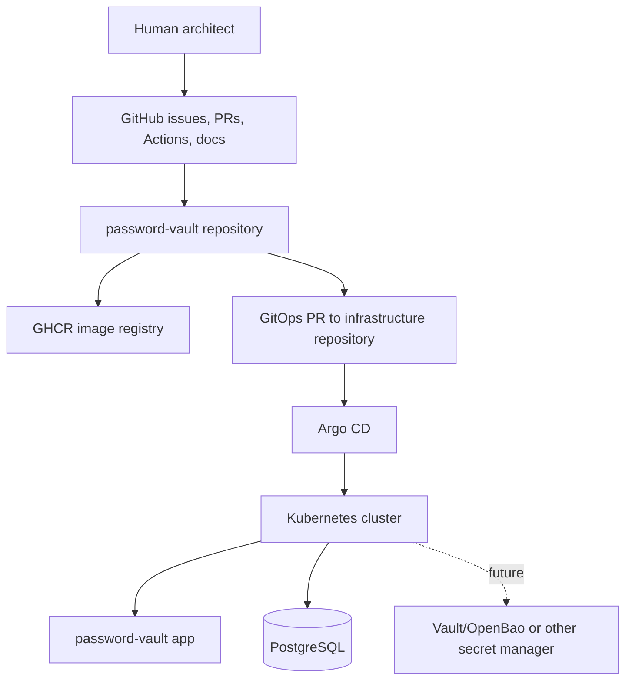
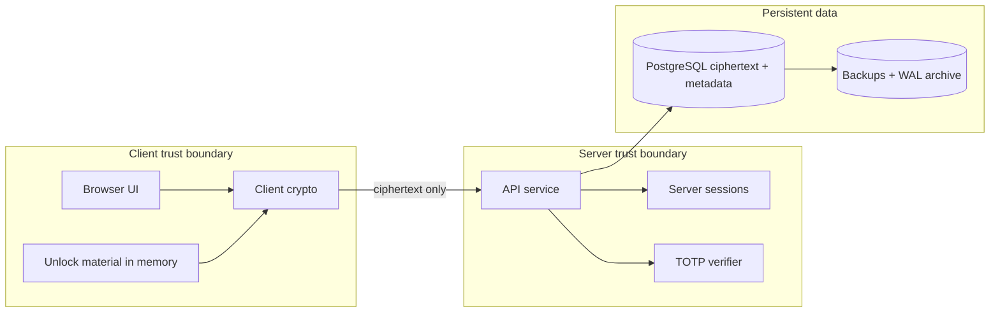
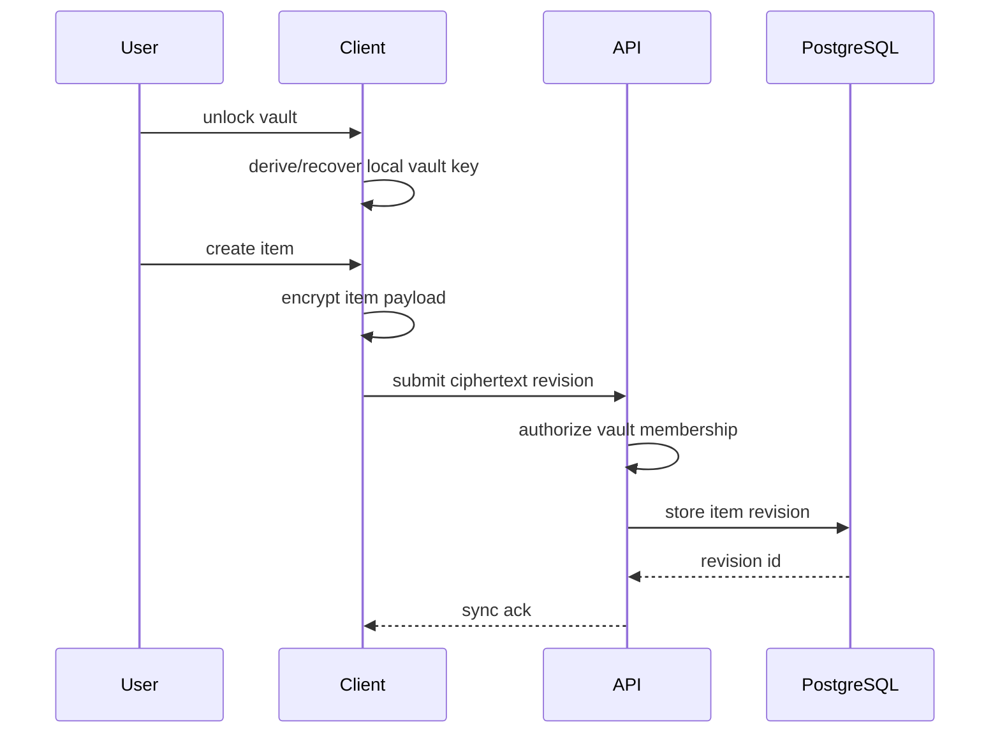
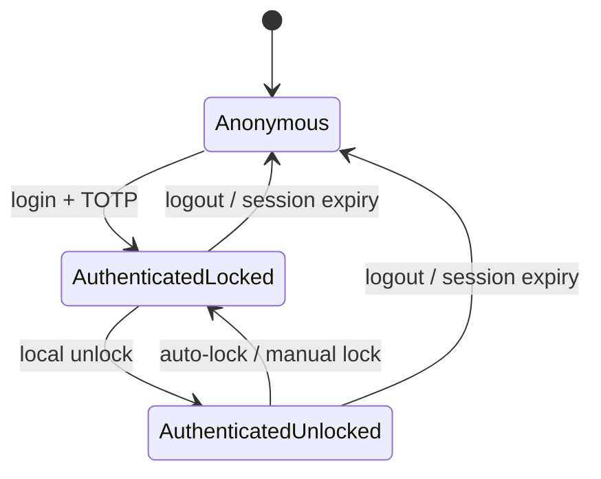
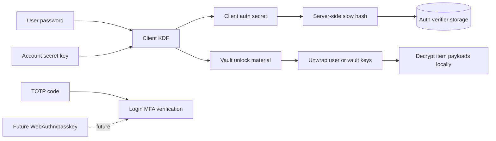
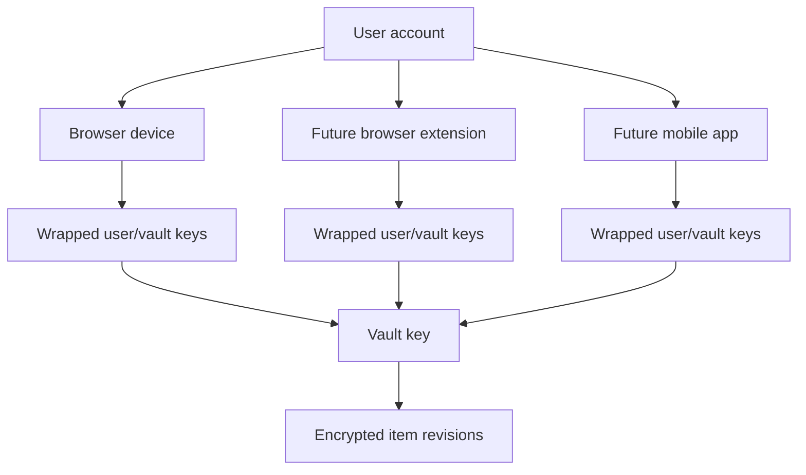
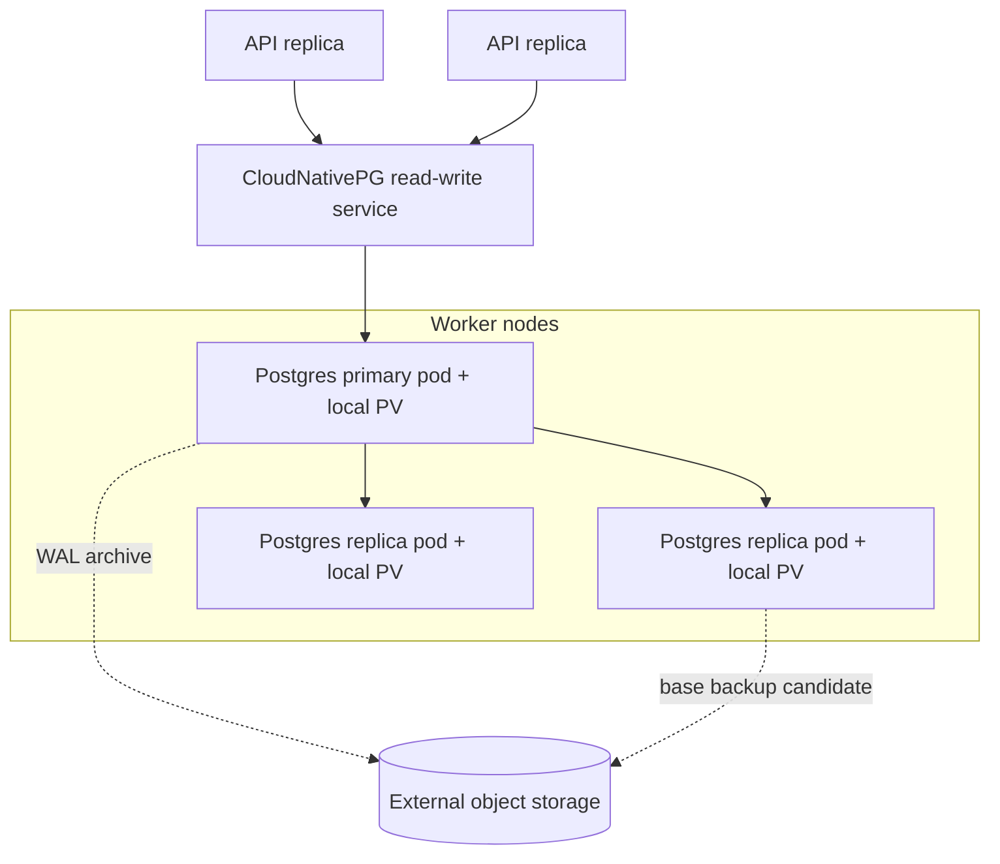

# Architecture Diagrams

Status: draft.

## System Context

## Trust Boundaries

## Vault Item Lifecycle

## Login And Unlock Separation

## Auth Direction For MVP And Future

The server session authenticates API access. The unlock path stays local to the client.

## Multi-Device Key-Wrap Direction

The first MVP client is the browser web app. The protocol and data model should still support
multiple enrolled devices from the beginning.

## Kubernetes Data Platform Direction

Local PVs do not move data between workers. Single-worker tolerance comes from PostgreSQL
replication plus failover, not from distributed storage.
