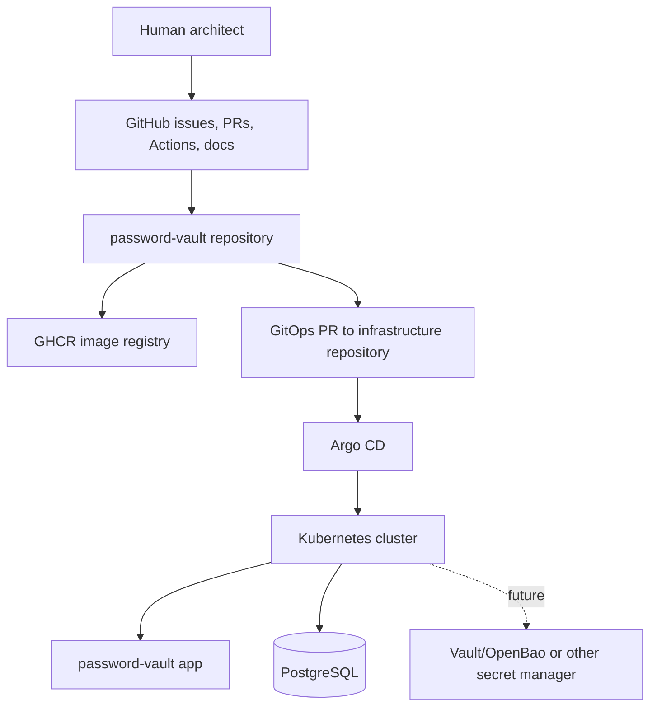
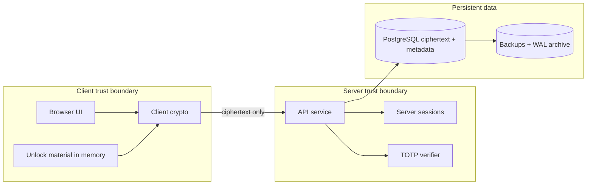
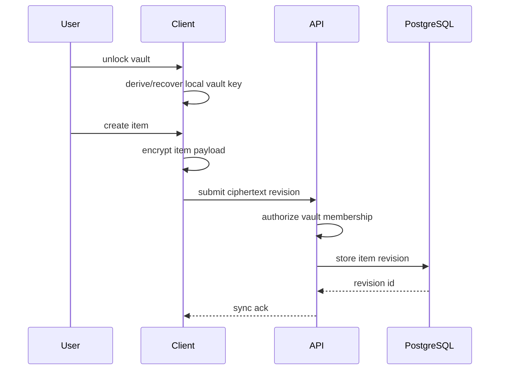
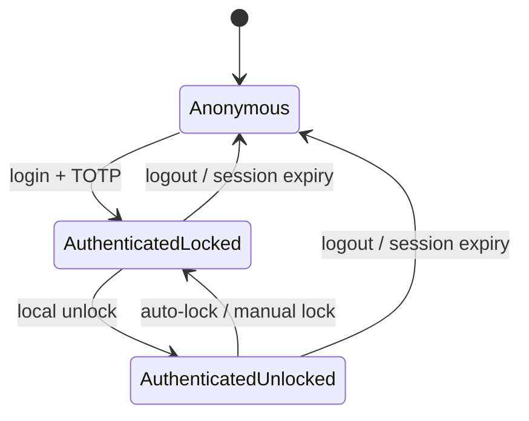
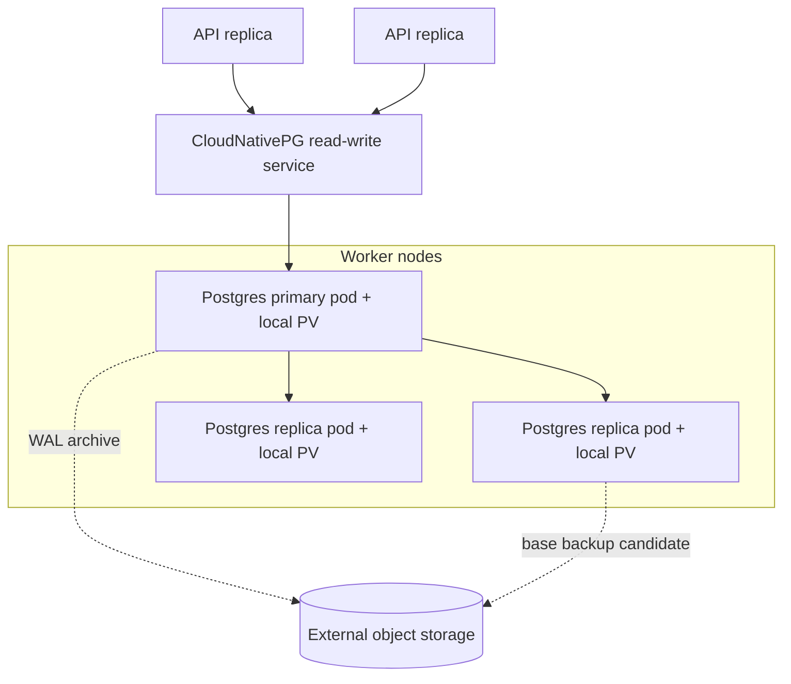

# Architecture Diagrams

Status: draft.

## System Context

## Trust Boundaries

## Vault Item Lifecycle

## Login And Unlock Separation

## Kubernetes Data Platform Direction

Local PVs do not move data between workers. Single-worker tolerance comes from PostgreSQL
replication plus failover, not from distributed storage.
