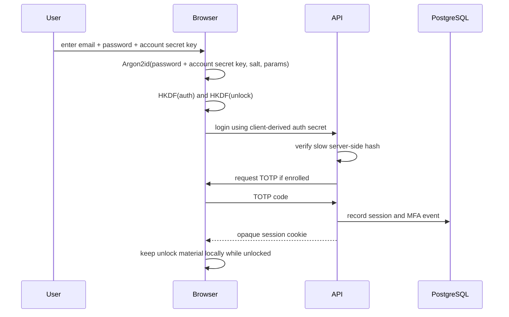
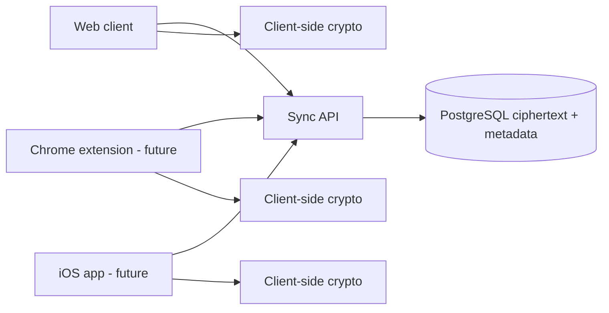

# Foundational Decisions

Status: draft for architecture discussion.

This document explains the current product decisions in plain engineering terms. It is not a final
cryptographic specification and must not be used as the only basis for implementation.

## Summary

`password-vault` should be a web-first, multi-device, Kubernetes-native password manager.

The MVP should start with one browser client, but the architecture must already support more than
one device. Chrome extension, iOS, desktop, and organization clients should become additional
clients of the same sync and encryption model, not separate products with separate storage.

Recommended baseline:

- Auth/login: derived-auth-key MVP, OPAQUE as long-term candidate after implementation review.
- Account secret key: recommended second KDF input for MVP to reduce password-only offline guessing
  risk after database compromise.
- Vault unlock: separate from login; local client unlock is required to decrypt vault items.
- KDF: Argon2id in browser through a reviewed pinned WASM dependency as the target.
- Key separation: one expensive KDF pass, then HKDF domain separation.
- AEAD: AES-256-GCM through WebCrypto for the browser MVP, preferably with per-revision content
  keys derived from the vault key.
- TOTP: login MFA only; not part of user vault decryption.
- Server auth storage: slow server-side hash of any client-derived auth secret.
- Database: PostgreSQL.
- Kubernetes database: CloudNativePG with three instances.
- Replication: quorum synchronous replication with one synchronous standby for real vault data.
- Backup: object-store WAL archiving plus physical base backups before real user secrets.
- GitHub workflow: GitHub Flow, issues first, draft PRs early, PR-only merge to `main`.

## Auth And Login Protocols

### What The Login Protocol Does

The login protocol answers the question: "Is this user allowed to create a server session?"

For this product, login must not be confused with vault unlock. A logged-in user may be allowed to
call the sync API, but the server session does not give the server the ability to decrypt vault item
payloads.

### Options

#### Simple Password Over TLS

The browser sends the password to the backend over HTTPS, and the backend hashes it.

This is common for ordinary web apps, but it is not the right public direction for a password
manager. The backend would handle the user's raw unlock secret, which increases logging, memory, and
server compromise risks.

Decision: rejected for public MVP.

#### Derived-Auth-Key Flow

The browser derives authentication material locally from the user's password and account secret key,
then sends an auth secret or proof-like value to the backend. The backend treats this value as
password-equivalent and stores only a slow server-side hash.

The browser also derives separate unlock material for wrapping/unwrapping user vault keys. This
separation is critical: compromising the auth database should not directly reveal vault item keys.

Decision: recommended MVP path, but it still needs a full protocol spec before code.

Recommended strengthening: generate a high-entropy account secret key during registration and never
store it server-side in plaintext. A stolen database should not be enough for normal password-only
offline guessing.

The protocol must also define a safe pre-login metadata flow. The browser needs KDF salt and
parameters before it can derive client-side auth material. A naive `GET /login-metadata?email=...`
endpoint can become a user-enumeration endpoint.

Recommended direction:

- normalize the login handle consistently;
- return a constant-shape response for existing and non-existing users;
- for existing users, return stored KDF metadata;
- for non-existing users, return deterministic synthetic metadata derived from a server secret and
  normalized login handle;
- use generic errors and rate limits;
- make the server-wide synthetic metadata secret backed up and rotated only through a documented
  migration.

#### OPAQUE

OPAQUE is an augmented PAKE protocol. It lets a client authenticate with a password without revealing
the password to the server and with stronger properties against pre-computation attacks after server
compromise.

Decision: preferred long-term direction, but not the default MVP choice until Rust and browser
library maturity, test vectors, dependency risk, and integration complexity are reviewed.

## Auth Flow Direction



The final protocol must define exact message shapes, salts, parameter storage, failure behavior,
rate limits, and how registration differs from login.

## Browser Crypto Direction

### Argon2id Versus PBKDF2

Argon2id is the target because it is memory-hard and is recommended by OWASP for password storage
when available. RFC 9106 defines Argon2 and includes Argon2id.

The browser problem: WebCrypto does not provide Argon2id. If we want Argon2id in the web client, we
need a WASM dependency. That means dependency review, pinning, test vectors, CI checks, and bundle
integrity controls become part of the security design.

PBKDF2 is available through WebCrypto and is easier to implement in browsers. It is a fallback, not
the preferred final design, because it is not memory-hard.

Decision: Argon2id/WASM is the production target. PBKDF2 must not be a silent runtime fallback. It
is allowed only as an explicitly approved prototype or degraded-mode decision with a migration plan.

Initial Argon2id parameter target should start from the OWASP minimum recommendation:

```text
memory: 19 MiB
iterations: 2
parallelism: 1
```

The final values must be tuned on representative browsers and devices. Unlock should remain usable,
but online login also needs throttling so the server-side slow hash does not become a denial-of-
service vector.

### HKDF Separation

Do not run multiple expensive password KDFs for every purpose. Run one expensive KDF, then use HKDF
with domain labels to derive separate keys or secrets:

```text
master secret
  -> HKDF("password-vault/auth/v1")
  -> HKDF("password-vault/unlock/v1")
  -> HKDF("password-vault/key-wrap/v1")
```

This keeps auth, unlock, wrapping, and future protocol material separated even if they originate
from the same user password.

### AES-GCM And Nonce Budget

AES-GCM is the browser MVP candidate because WebCrypto supports it. Its failure mode is severe:
nonce reuse under the same key can compromise confidentiality and integrity.

The preferred MVP direction is:

- keep a vault key as a wrapping/root data key;
- derive a unique item-revision content key with HKDF using vault ID, item ID, revision ID, and key
  epoch;
- encrypt exactly one payload per derived content key;
- still store a 96-bit AES-GCM nonce and associated data.

This makes the per-key AES-GCM encryption budget simple for MVP: one encryption per item-revision
content key. The crypto spec still must define:

- random or deterministic nonce generation;
- where nonce and key epoch are stored;
- maximum number of encryptions per vault key;
- rekey trigger before the budget is approached;
- associated data binding;
- tests proving nonce uniqueness within the modeled budget.

XChaCha20-Poly1305 is attractive because a larger nonce makes random nonce management easier, and it
is available in strong native libraries. The browser tradeoff is that it is not WebCrypto-native, so
it would require a separate JavaScript or WASM crypto dependency. For the web MVP, that is probably
more supply-chain risk than value.

Decision: AES-256-GCM for browser MVP; XChaCha20-Poly1305 can be revisited for native clients or if
a reviewed browser dependency is accepted.

## TOTP Seed Custody

TOTP is a server-verified login factor. The server must be able to validate codes, so the TOTP seed
is a server-owned authentication secret.

TOTP must not be treated as a vault encryption key.

Recommended MVP requirements:

- use RFC 6238 test vectors;
- use a narrow accepted time-step window;
- track last accepted time step to reject replay;
- rate limit per account and per source;
- provide recovery codes;
- encrypt TOTP seeds at rest;
- decide whether seed encryption is app-level or uses Vault/OpenBao Transit/KMS.

Recommended staged direction:

- if Vault/OpenBao is not deployed yet, MVP may use app-level AEAD with an app seed-encryption key
  supplied as a runtime Kubernetes Secret;
- if Vault/OpenBao is available and approved, prefer Transit/KMS for TOTP seed encryption;
- in both cases, document that database compromise alone should not expose TOTP seeds;
- in both cases, Vault/OpenBao must not become the user vault decrypt path.

## Multi-Device Direction

MVP should be web-client only, not single-device.

Meaning:

- only browser UI is implemented first;
- protocol and database assume many devices per user;
- all clients download encrypted revisions and decrypt locally;
- each device can be represented as a `devices` row and optional device key material later;
- browser extension and iOS app become future clients of the same API and crypto format.

For the first MVP, multiple browser sessions can unlock the same vault by deriving the same account
unlock material from the user's password, account secret key, and KDF metadata. Strong per-device
cryptographic enrollment can wait until WebAuthn/passkeys or native clients are designed.

This avoids redesigning the product when the Chrome extension arrives.



## PostgreSQL HA Direction

CloudNativePG uses PostgreSQL application-level replication, not storage-level replication. With
local-path storage, each PostgreSQL instance has its own node-local volume. A failed worker's volume
does not move to another worker automatically.

Recommended production-like baseline:

- three CloudNativePG instances;
- required anti-affinity across worker hostnames if capacity allows;
- quorum synchronous replication: `method: any`, `number: 1`;
- `dataDurability: required` as the initial recommendation for real vault data;
- evaluate `preferred` only if write availability during degraded states is more important than
  acknowledged-write durability;
- object-store backups and WAL archiving before real user data;
- restore drill into a separate namespace before public real-data use.

Rationale: for a password manager, accepting a saved password and then losing it on failover is a
serious product failure. A temporary write pause during degraded state is easier to explain than
acknowledged data loss.

## GitHub Workflow Direction

Use GitHub Flow:

1. Create or select an issue.
2. Create a short branch from `main`, for example `docs/8-auth-protocol` or `feat/12-login-api`.
3. Commit focused changes.
4. Open a draft PR early for non-trivial work.
5. Run CI on GitHub-hosted runners.
6. Review, including Claude Code for security, architecture, frontend, and larger diffs.
7. Merge to `main` only through PR after checks pass.
8. Delete the branch after merge.

For this product, GitHub Flow must be stricter than a normal toy repo:

- no direct pushes to `main`;
- no self-hosted public runner on the home mini-PC;
- minimal Actions permissions;
- no `pull_request_target` workflows that execute untrusted code;
- CODEOWNERS for workflows, crypto, auth, security docs, and deployment manifests;
- GitOps PR to `infrastructure-home` for cluster changes.

## GitHub Project Views

GitHub Project views are saved ways to look at the same issue/PR backlog. They do not create new
tasks; they only filter, group, and display existing items.

Useful views for this project:

- `Board`: columns by status, such as Backlog, Ready, In progress, In review, Done.
- `Research`: filter to research and ADR items.
- `Security`: filter/group crypto, auth, and high-risk items.
- `MVP`: filter to MVP-phase work.
- `Infrastructure`: show DB, Kubernetes, GitOps, and backup work.

The working public project is `Password Vault MVP` at
`https://github.com/users/ded-isshin/projects/2`.

## Implementation Blockers

Product code should wait for these artifacts:

- threat model v1;
- auth/login protocol ADR with registration and login message shapes;
- account secret key UX and recovery implications;
- pre-login salt and KDF-parameter delivery design, including user-enumeration behavior;
- crypto v1 spec with KDF, HKDF labels, AEAD payload format, nonce/rekey rules, and tests;
- Argon2id browser dependency review and concrete memory/time parameters;
- PBKDF2 fallback minimum and explicit downgrade gate, if fallback remains allowed;
- TOTP seed custody decision;
- login/TOTP rate-limit and session lifetime policy;
- PostgreSQL HA, backup, and restore ADR;
- GitHub branch ruleset/public safety decision.

## Decision Briefs

- [Auth and crypto MVP](decision-briefs/2026-06-07-auth-crypto-mvp.md)
- [Client and multi-device roadmap](decision-briefs/2026-06-07-client-roadmap.md)
- [GitHub workflow](decision-briefs/2026-06-07-github-workflow.md)
- [PostgreSQL HA and backup](decision-briefs/2026-06-07-postgresql-ha-backup.md)

## Sources

- https://www.rfc-editor.org/rfc/rfc9807.html
- https://www.rfc-editor.org/rfc/rfc9106.html
- https://www.w3.org/TR/webcrypto/
- https://www.rfc-editor.org/rfc/rfc6238.html
- https://cheatsheetseries.owasp.org/cheatsheets/Password_Storage_Cheat_Sheet.html
- https://cheatsheetseries.owasp.org/cheatsheets/Cryptographic_Storage_Cheat_Sheet.html
- https://cheatsheetseries.owasp.org/cheatsheets/Key_Management_Cheat_Sheet.html
- https://cloudnative-pg.io/docs/1.27/replication/
- https://cloudnative-pg.io/docs/1.29/backup/
- https://cloudnative-pg.io/docs/1.29/recovery/
- https://cloudnative-pg.io/docs/1.29/scheduling/
- https://docs.github.com/en/get-started/using-github/github-flow
- https://docs.github.com/en/issues/planning-and-tracking-with-projects/customizing-views-in-your-project
- https://git-scm.com/book/en/v2/Distributed-Git-Distributed-Workflows
