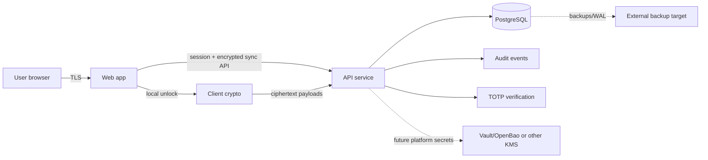
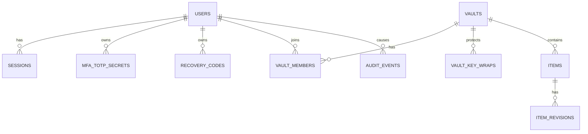
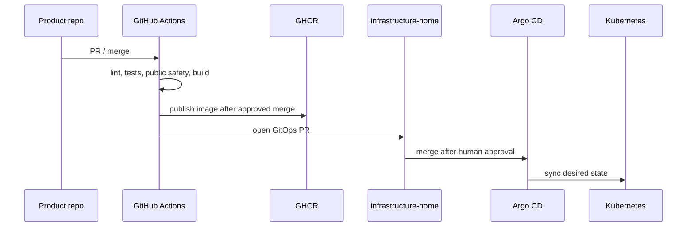

# Password Vault Whitepaper

Status: draft for architecture discussion. Do not treat this as a production security claim.

## Executive Summary

`password-vault` is planned as a Kubernetes-native password manager. The first milestone is a
personal web vault MVP with registration, login, TOTP MFA, encrypted item storage, item revisions,
and a GitOps deployment path.

The product direction is closer to 1Password or Bitwarden than to a hosted KeePass file. KeePass/KDBX
compatibility is valuable later for import/export, but it is not the right primary storage model for
a SaaS product with synchronization, future sharing, audit, and multi-user access control.

The target security model is zero-knowledge for vault item contents:

- the server stores ciphertext and synchronization metadata;
- the server does not receive plaintext vault item contents;
- the server does not receive or persist unwrapped user vault keys;
- the MVP uses an account secret key as a second KDF input so a stolen database is less useful for
  password-only offline guessing;
- TOTP protects account login, not vault decryption;
- forgotten vault unlock material is unrecoverable unless a future zero-knowledge recovery design is
  approved.

## Product Goals

### MVP Goals

- Personal user registration.
- Login and session management.
- TOTP enrollment, verification, replay protection, and recovery codes.
- One personal vault first.
- Encrypted item create/read/update/delete.
- Item revision history.
- Basic audit events without secret values.
- Cross-user and cross-vault denial tests.
- GitHub Actions CI.
- GitOps-compatible deployment design.

### Post-MVP Goals

- WebAuthn/passkeys.
- KeePass/KDBX import.
- Organizations.
- Shared vaults.
- Browser extension.
- Mobile and desktop clients.
- Rich client-side search and encrypted metadata strategy.
- Platform secret-management integration.

## Non-Goals

- No server-side plaintext vault item storage.
- No admin recovery that can decrypt user vault data.
- No organizations in the first MVP.
- No browser extension in the first MVP.
- No ClickHouse primary database.
- No Vault/OpenBao-backed user-vault decrypt path.
- No direct Kubernetes mutation from the product repository.

## Security Principles

### Zero-Knowledge Boundary

The vault item encryption boundary is the client. The backend may authenticate users, enforce access
control, store ciphertext, and synchronize revisions, but it must not be able to decrypt user vault
item payloads.

### Authentication Is Not Decryption

Login session state and vault unlock state are separate. A server session authorizes API access. The
client still needs unlock material to decrypt vault item payloads locally.

### TOTP Is Login MFA

TOTP is a login factor. It is not phishing-resistant and must not be used as a vault encryption key.
TOTP seeds are server-side authentication secrets because the server must verify codes.

### Web MVP Residual Risk

The web MVP depends on JavaScript delivered by the service. A compromised delivery path can ship
malicious JavaScript and steal unlock material before encryption. CSP, dependency review, signed
artifacts, and CI controls reduce risk but do not remove this structural problem.

This residual risk is accepted for the web MVP and should be revisited when browser extension,
desktop, or mobile clients are designed.

## Proposed Architecture

## Client Responsibilities

- Collect unlock input.
- Derive or recover client-side key material.
- Encrypt and decrypt vault item payloads.
- Track local lock/unlock state.
- Perform local search over decrypted data.
- Avoid sending plaintext vault item contents to the backend.

## Backend Responsibilities

- Register accounts according to the selected auth protocol.
- Manage opaque server sessions.
- Verify TOTP and recovery codes.
- Enforce user/vault authorization.
- Store encrypted item revisions.
- Store non-secret sync metadata.
- Record audit events without secret values.
- Expose health/readiness endpoints.

## Data Model Direction

The database stores product state and ciphertext. It must not store plaintext vault item contents or
unwrapped user vault keys.

The recommended MVP metadata boundary is conservative:

- encrypted in the client payload: title, URL, username, password, notes, tags, and custom fields;
- visible to the server: IDs, membership boundaries, revision counters, change cursors, timestamps,
  tombstones, crypto versions, and ciphertext sizes.

This means server-side content search is out of scope for MVP. Search happens locally after unlock.

See [Data Model Draft](data-model.md) and [Sync Protocol Draft](sync-protocol.md).

Explicit device records are deferred until device enrollment, revocation, browser extension, or
mobile-client work requires them. The MVP should still avoid single-device assumptions through
session tracking, encrypted key wrapping, and revision-based sync.

## Lock And Unlock Direction

Login and unlock are separate product states:

- logged out;
- logged in but locked;
- logged in and unlocked.

A server session lets the client call authorized sync APIs. It does not let the server decrypt vault
items. Vault unlock material should prefer in-memory storage for the MVP, which may require the user
to unlock again after refresh, browser close, or auto-lock.

See [Lock And Unlock State Model](lock-unlock-state.md).

## Account Recovery Direction

Account recovery codes are MFA recovery codes. They should let a user recover from a lost TOTP
device and re-enroll MFA. They must not silently become a vault decrypt path.

The product should decide separately whether to include a zero-knowledge-compatible vault recovery
key in MVP. If not included, losing the vault unlock secret means losing vault access. If a future
account secret key is accepted, losing it may also affect vault access depending on the recovery
design.

See [Auth And MFA Lifecycle](auth-mfa-lifecycle.md).

## Deployment Direction

Deployment is planned through GitOps. Direct cluster mutation from this repository is out of scope.

## Technology Direction

### Recommended MVP Stack

- Backend: Rust, Axum, Tokio, SQLx.
- Frontend: TypeScript, React, Vite.
- Browser crypto: WebCrypto where possible.
- Browser KDF: Argon2id through reviewed WASM as the target; PBKDF2 fallback only if documented.
- Primary database: PostgreSQL.
- Kubernetes database operator: CloudNativePG.
- PostgreSQL replication: quorum synchronous replication is the target for real user data, with
  `dataDurability: required` recommended for real user data.
- CI: GitHub Actions on GitHub-hosted runners.
- Image registry: GHCR.
- Deployment: Helm chart plus Argo CD.

### Why Rust

Rust is recommended because this is a security-sensitive service and Rust gives strong memory-safety
and type-safety properties. Rust does not make cryptography safe by itself, so the implementation
must still avoid custom primitives and keep the MVP small.

### Why PostgreSQL

PostgreSQL is the right source of truth for account, MFA, session, vault membership, encrypted item
revision, and audit data. ClickHouse is not a fit for transactional secret-vault state.

### Why Vault/OpenBao Is Not Core Storage

Vault/OpenBao can help with platform secrets, dynamic database credentials, PKI, or server-owned
TOTP seed encryption. It must not be the database or decrypt service for user vault item payloads.

## Required Decisions Before Product Code

1. Threat model v1.
2. Auth/login and key-derivation protocol.
   This includes deciding whether account secret key / two-secret key derivation is accepted later
   as optional hardening.
3. Browser KDF and crypto v1 payload format.
4. TOTP seed custody and MFA hardening.
5. PostgreSQL HA, replication mode, backup, and restore design.
6. GitHub ruleset and public repository safety gates.
7. Multi-device-capable account, key-wrap, and sync model.
8. Plaintext metadata boundary.
9. Recovery key vs account recovery codes.
10. Item revision and delta-sync protocol.

The auth and crypto decision must explicitly define server storage of client-derived auth material,
AES-GCM nonce budgets, and the one-pass KDF plus HKDF domain-separation model.

## Sources

- https://agilebits.github.io/security-design/
- https://bitwarden.com/help/bitwarden-security-white-paper/
- https://www.rfc-editor.org/info/rfc9807/
- https://www.w3.org/TR/webcrypto/
- https://www.rfc-editor.org/rfc/rfc9106.html
- https://www.rfc-editor.org/info/rfc6238/
- https://cheatsheetseries.owasp.org/cheatsheets/Key_Management_Cheat_Sheet.html
- https://cheatsheetseries.owasp.org/cheatsheets/Cryptographic_Storage_Cheat_Sheet.html
- https://cloudnative-pg.io/docs/1.29/architecture/
- https://cloudnative-pg.io/docs/1.29/replication/
- https://cloudnative-pg.io/docs/1.29/backup/
- https://cloudnative-pg.io/docs/1.29/recovery/
- https://kubernetes.io/docs/concepts/storage/persistent-volumes/
- https://kubernetes.io/docs/concepts/services-networking/ingress/
- https://docs.github.com/en/issues/planning-and-tracking-with-projects
